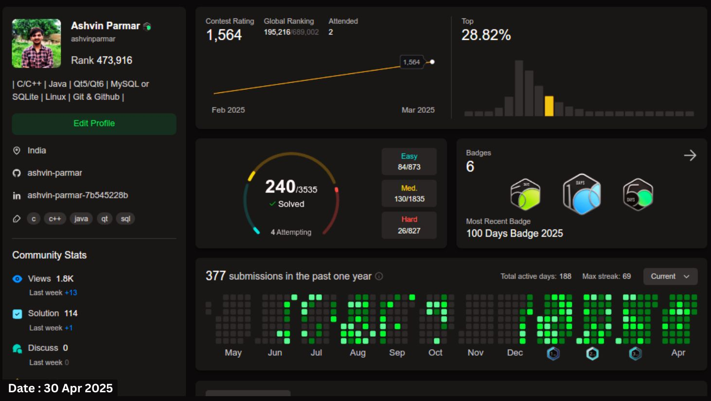

<h1 align="center"> Hi 👋🏻, I'm Ashvin </h1>

I am a software developer with expertise in C, C++, Core Java, and data structures.

<!--   -->

 

<!--   -->

- 💼 &nbsp;**Open to Work** – Actively seeking exciting opportunities in software development!
- 🚀 &nbsp;**Backend Software Developer** – Passionate about building scalable and efficient solutions.  
- 💬 &nbsp;Love discussing **C++, Java, DSA, and System Design** – Let’s talk tech!  

<!--   -->

I have experience in designing and implementing software using a three-layered architecture, which typically consists of the presentation layer, business logic layer, and data access layer. This approach promotes separation of concerns, scalability, and maintainability in software development. Experienced working with version control systems like Git and GitHub and on Linux environments.
 

I am currently focused on building a strong foundation in Machine Learning by creating tools from scratch. This hands-on approach allows me to deeply understand core concepts, algorithms, and their implementation. My aim is to develop efficient, custom solutions while gaining practical insights into the underlying mechanics of Machine Learning.

<h2 align="left" id="ninexcode-tech">Working Tech</h2>

> Technologies I work with: Languages, Tools, and Frameworks.

<table>
  <tr>
    <td align="center" width="96">
      
       Java
    </td>
    <td align="center" width="96">
      
       C++
    </td>
    <td align="center" width="96">
      
       C
    </td>
    <td align="center" width="96">
      
       QT
    </td>
    <td align="center" width="96">
      
       MySQL
    </td>
    <td align="center" width="96">
      
       SQLite
    </td>
    <td align="center" width="96">
      
       Vim
    </td>
    <td align="center" width="96">
      
       Linux
    </td>
    <td align="center" width="96">
      
       Git & Github
    </td>
    <td align="center" width="96">
      
       Gradle
    </td>
  </tr>
</table>

<h2 align="left">LeetCode Profile</h2>

> Passionate to code solutions to problems and develop new approach.

  

<!-- links -->

[Mail]:  mailto:ashwinparmar8181@gmail.com "Mail-To-Asvin"
[Linkedin]: https://www.linkedin.com/in/ashvinparmar/ "Ashvin LinkedIn"
[Resume]: https://docs.google.com/document/d/1SF8s2uo9oykIxZ3OBl8LeeJFczvolE_diWwFvPr2-Ps/edit?usp=sharing "My Resume"
