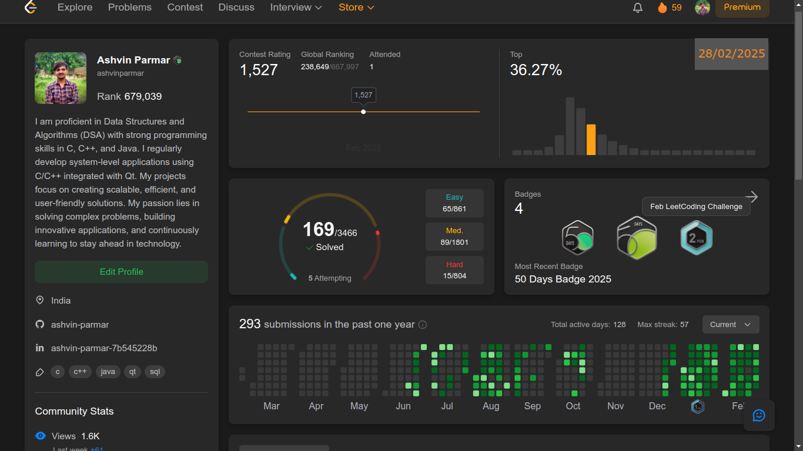

<h1 align="center"> Hi 👋🏻, I'm Ashvin </h1>

I love to code in C++, Java and Data Sctructure

 

- :office: &nbsp;I'm currently working at **Google**
- :seedling: &nbsp;I’m currently working as a **Full-Stack Software Engineer**
- :speech_balloon: &nbsp;I like to talk about **C++, Java, DSA** and **System Design**
- :book: &nbsp;Know more about my projects on my **[Resume]**
- :mailbox: &nbsp;Mail me to HIRE **mymail@email.com**
- :computer: &nbsp;Connect with me on **[LinkedIn]**

 

<h2 align="left" id="ninexcode-tech">Favorite Tech</h2>

> Tools, languages, and other things that I like to work with.

<table>
  <tr>
    <td align="center" width="96">
      
       Java
    </td>
    <td align="center" width="96">
      
       Python
    </td>
    <td align="center" width="96">
      
       Linux
    </td>
  </tr>
</table>

<h2 align="left">LeetCode Profile</h2>

> Total logged open-source coding time since 2020-07-19. Updated every 1 hour.

  

<!-- links -->

[linkedin]: https://www.linkedin.com/in/# "9xcode LinkedIn"
[Resume]: # "My Resume"
